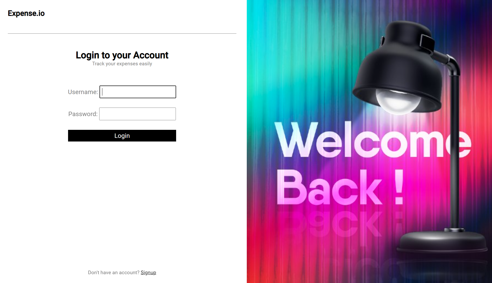

# Simple Expense Tracker
This is a simple project used to track user expenses. This is part of an Advanced Programming course unit while undertaking the bachelors of computer science intended to demonstrate basic operations and functions in django as well as implementation of security principles.

## Screenshots
User Authentication



Project Dashboard


New Expense


## Setting up development
1. Clone the repository
   ```bash
   git clone https://github.com/edgarmuyomba/simple_expense_tracker.git 
   ```
2. Enter the repository where the project has been created. `simple_expense_tracker`
   ```bash
   cd simple_expense_tracker
   ```
3. create a virtual environment
   ```bash
   python -m venv env
   ```
4. Activate the virtual environment
   ```bash
   env\scripts\activate
   ```
5. Install the necessary requirements
   ```bash
   pip install -r requirements.txt
   ```
6. Create a file in the base directory of the project named `.env`
7. Contact me for the django-secret key
8. Run the project server and access the project on [localhost:8000](localhost:8000)
   ```bash
   python manage.py runserver
   ```

## Built with
- [Django](https://www.djangoproject.com/)
- [python-dotenv](https://pypi.org/project/python-dotenv/)